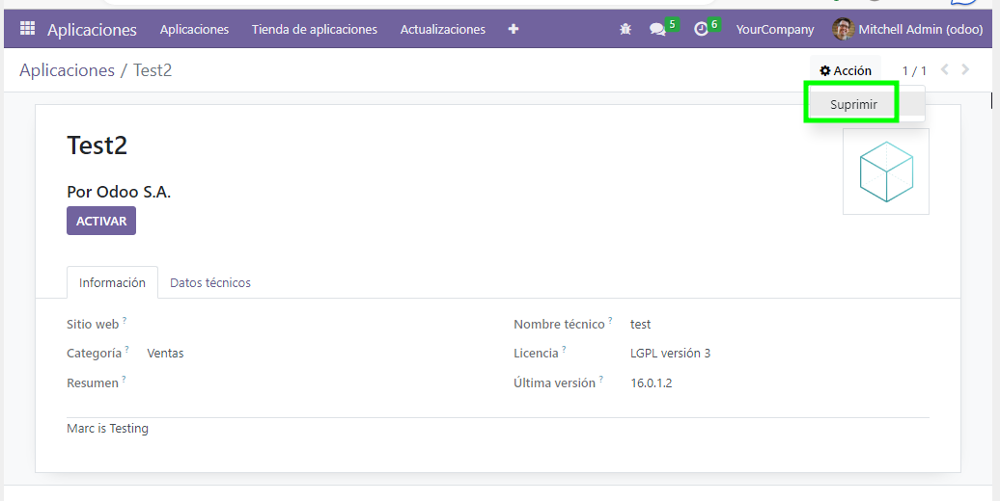

# External Agents

## Objectiu
"External Agents" serveix com exemple per a la creació d'un mòdul d'aplicació d'exemple per a Odoo 16.0. Per l'exemple en questió s'ha utilitzat un entorn amb Microsoft Windows i l'instal·lable de la versió [community](https://www.odoo.com/es_ES/page/download) de Odoo.

Podeu trobar la informació detallada per la creació d'un mòdul a la documentació corresponent de Odoo: ["Getting Started"](https://www.odoo.com/documentation/16.0/developer/tutorials/getting_started.html)

## Estructura d'un mòdul / aplicació
Analitzarem en detall els continguts, estructura i utilitat d'aquests fitxers en la classe magistral corresponent. No obstant anotem un resum de l'estructura:

```
│
├── data               # Arxius per a popular la BD per exemple.
├── models             # Les classes representatives del mòdul i que contenen la lògica de negoci.
├── security           # Establir les capes de permisos i nivells d'accés.
├── views              # Definirem com i que representar visualment.
├── __init__.py        # Arxiu d'inicialització de càrrega
├── __manifes__.py     # Manifest amb informació detallada sobre el projecte, dependències, documents a carregar, versió, ... analitzeu-lo.

```
El directori `assets` conté únicament imatges per a la documentació d'aquest README.md.

## Instal·lació
### Activar el mode desenvolupador
És **molt important** activar el mode desenvolupador a l'aplicació, per tal de poder recarregar la llista de mòduls disponibles. Podeu fer-ho des de:

.

### On ubicar-ho?
Heu de desar el contingut del repositori en una nova carpeta, anomenada per exemple `agents` dins de `C:\Program Files\Odoo 16.0.x\server\odoo\addons`. Aquí podeu anar creant carpetes pels diferents mòduls que vulgueu desplegar a la vostra instal·lació del Odoo.

### Com instal·lar l'aplicació
Perquè detecti la nova aplicació, haurem d'actualitzar la llista d'aplicacions disponibles al sistema a través de l'opció:
```
Aplicaciones >> Actualizar lista de aplicaciones
```
Adjuntem captura:


i tot seguit...


Una vegada actualitzat ja podem cercar la nova aplicació des del buscador d'aplicacions i activar-la perquè quedi instal·lada:


Si tot ha anat correctament ja ens apareixerà l'opció de **External Agents** a la llista d'aplicacions del sistema. Al entrar-hi veurem que s'ha emplenat la taula corresponent amb les dades d'exemples de l'arxiu .CSV de la carpeta `data`:


### Proveu i remeneu
A partir d'aquí, podeu provar de crear, editar i eliminar diferents agents de la base de dades de l'aplicació instal·lada. Veureu com en realitat amb pocs passos em pogut desplegar una aplicació integrada en el nostre ERP. Amb uns quants coneixements més podríem ampliar la complexitat i interrelació d'aquesta aplicació amb altres mòduls i aplicacions del nostre ERP per donar-li encara més sentit.

## Editar i recarregar l'aplicació
Existeixen formes de poder-ho fer mitjançant el desplegament de versions, però per les proves que vulgueu realitzar sobre aquesta aplicació d'exemple per afegir-hi funcionalitat, camps, dades, permisos o el que convingui, caldrà tenir en compte aquests punts.

Cada cop que hi realitzeu canvis haureu de:
* Desinstal·lar l'aplicació.
* Eliminar l'aplicació del catàleg.
* Reiniciar el servei de Odoo.
* Procedir com des de l'inici (actualitzar aplicacions + instal·lació) vistos a l'inici del document.

### Desinstal·lar l'aplicació
Des de la llista d'aplicacions podeu cercar l'aplicació altre cop ("Agents") i procedir a desinstal·lar-ho:


### Eliminar l'aplicació del catàleg
Des de la llista d'aplicacions, altre cop, cal cercar l'aplicació i accedir a "Mas información" per poder-la suprimir del catàleg:




### Reiniciar el servei
Finalment, abans de tornar a instal·lar el mòdul cap reiniciar el servei que gestiona el servidor de Odoo. Pel cas de Windows és `odoo-server-x` des de la llsita de serveis del sistema:


